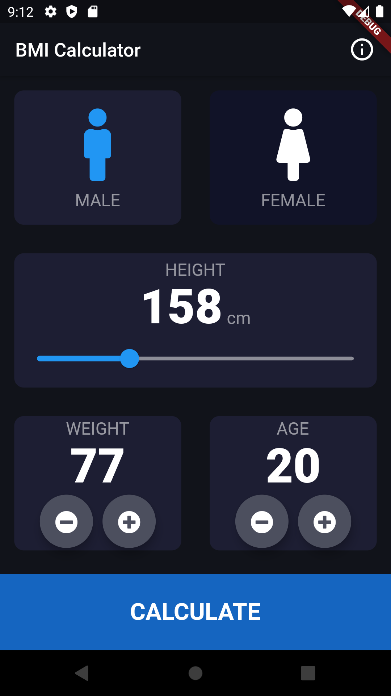
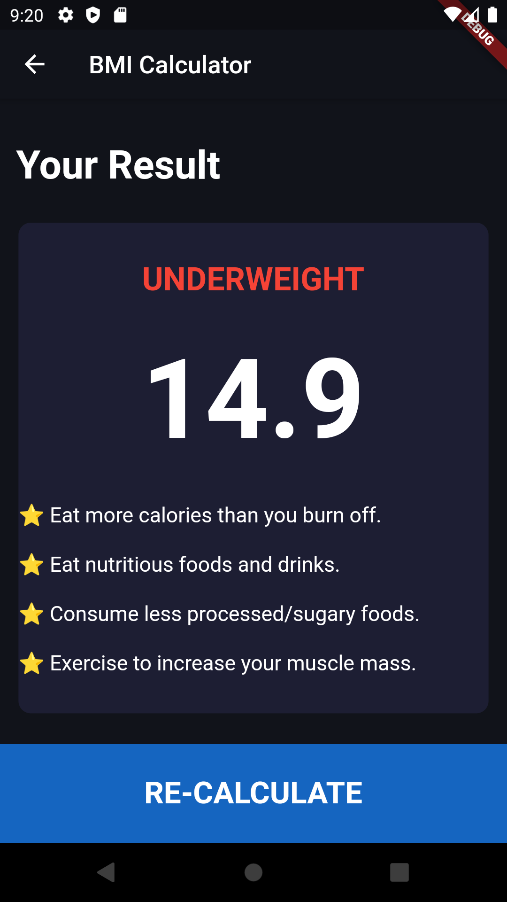
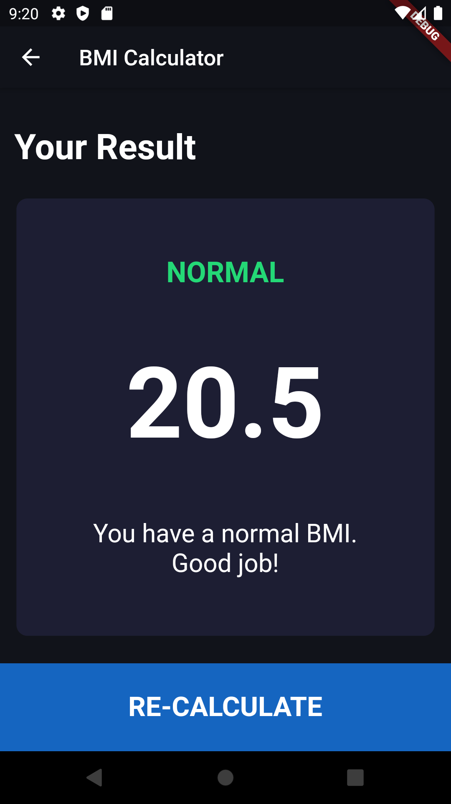
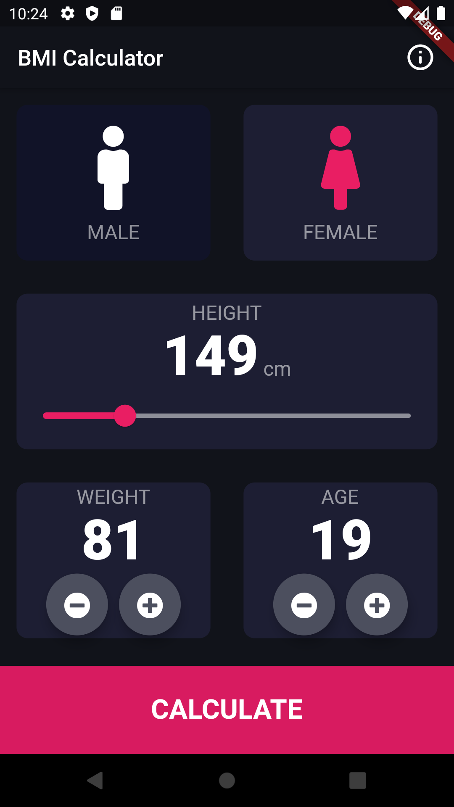
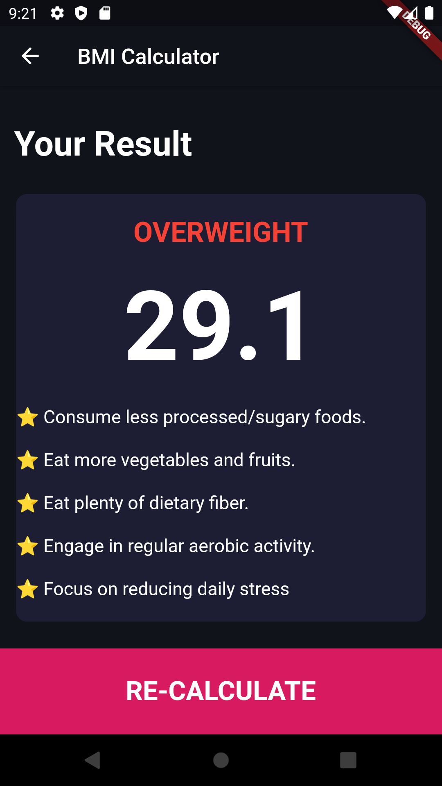
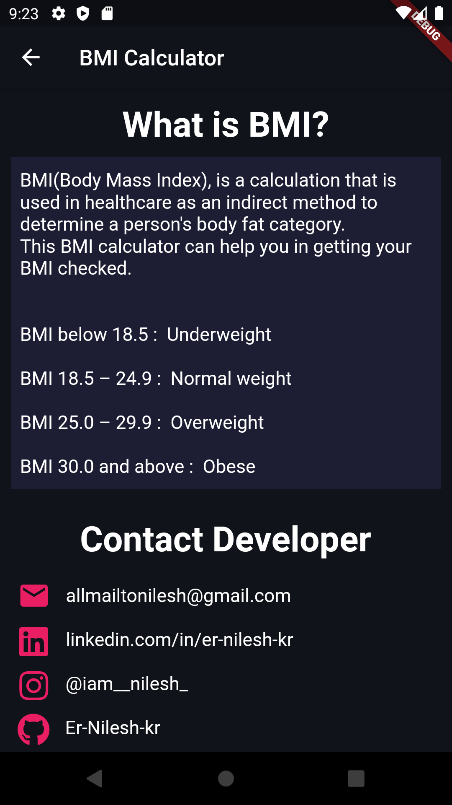

# BMI-Calculator

A Flutter app that calculates your Body Mass Index and gives you appropriate remarks based on the calculated result.

## Sample Screenshot

<table>
  <tr>
    <td></td>
    <td></td>
    <td></td>
  </tr>
</table>
 
<table>
  <tr>
    <td></td>
    <td></td>
    <td></td>
  </tr>
</table>
